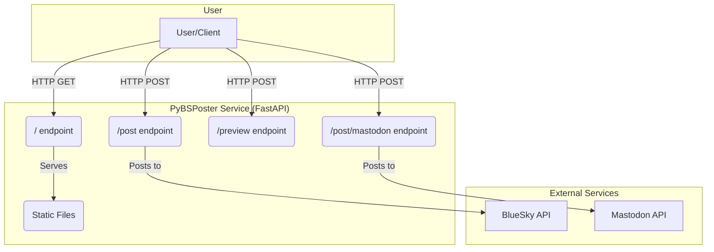
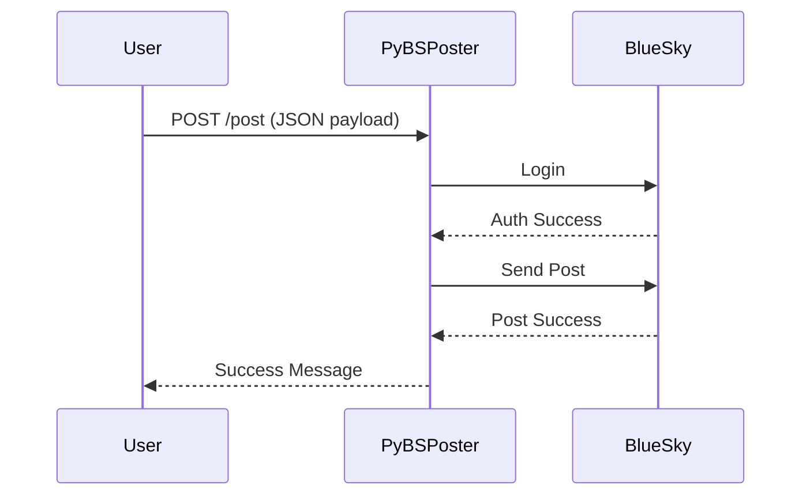
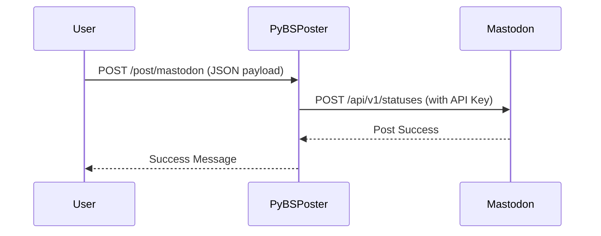

### Component Diagram

```mermaid
graph TD
    subgraph User
        A[User/Client]
    end

    subgraph "PyBSPoster Service (FastAPI)"
        B(/ endpoint)
        C(/post endpoint)
        D(/preview endpoint)
        E(/post/mastodon endpoint)
        F(Static Files)
    end

    subgraph "External Services"
        G[BlueSky API]
        H[Mastodon API]
    end

    A -- HTTP GET --> B
    A -- HTTP POST --> C
    A -- HTTP POST --> D
    A -- HTTP POST --> E
    B -- Serves --> F

    C -- Posts to --> G
    E -- Posts to --> H
```

### Sequence Diagram: BlueSky Post

```mermaid
sequenceDiagram
    participant User
    participant PyBSPoster
    participant BlueSky

    User->>PyBSPoster: POST /post (JSON payload)
    PyBSPoster->>BlueSky: Login
    BlueSky-->>PyBSPoster: Auth Success
    PyBSPoster->>BlueSky: Send Post
    BlueSky-->>PyBSPoster: Post Success
    PyBSPoster-->>User: Success Message
```

### Sequence Diagram: Mastodon Post

```mermaid
sequenceDiagram
    participant User
    participant PyBSPoster
    participant Mastodon

    User->>PyBSPoster: POST /post/mastodon (JSON payload)
    PyBSPoster->>Mastodon: POST /api/v1/statuses (with API Key)
    Mastodon-->>PyBSPoster: Post Success
    PyBSPoster-->>User: Success Message
```